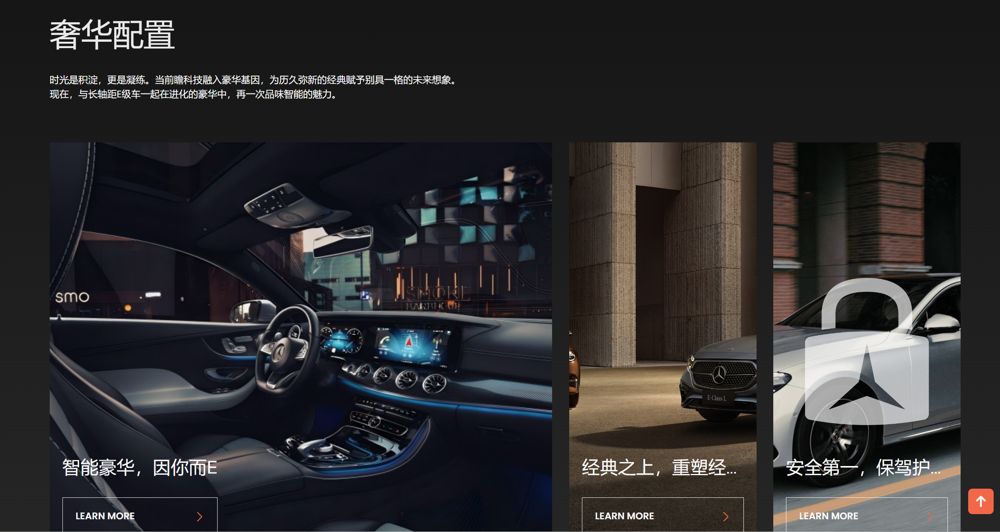
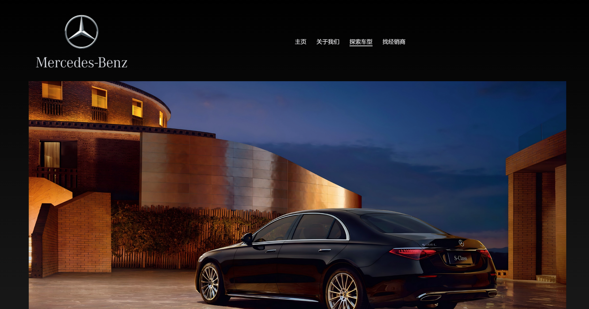

# 静态搭建奔驰官网展示

> 代码仓库：https://github.com/fff9871/Benz_simulate
>
> 代码网站：
>
> 外链网页：https://www.mercedes-benz.com.cn/dealers.html"

## 一、主题

本网站旨在学习HTML，CSS，JavaScript初步用法，搭建一个静态网页，仿照奔驰售卖官网，展示热门车型并提供一些服务，页面包含图片滚动展示，图片缩放，视频超链接等内容。

## 二、页面内容

```
main
|
├─首页
├─关于我们
├─车型探索
|  └─轿车
|  └─SUV
|  └─AMG
└─找经销商
```

- 首页：用**轮播图**的形式展示奔驰热门车型的海报，展示奔驰系列豪华配置，并配置介绍视频可跳转；
- 关于我们：简要介绍本网站的设计理念；
- 车型探索：下有三个子页面，分别展示不同车型的热门型号；
- 找经销商：点击跳转奔驰官网的经销商网站，提供给用户方便寻找自身位置附近的售车地点。

## 三、页面概览







## 四、主要技术

- Font Awesome： Font Awesome 图标库，允许在网页中使用各种图标。可以通过添加特定的类名来显示图标，增强用户界面的可视化效果。
- Bootstrap： Bootstrap 框架的样式，提供基础的样式、布局和组件（如按钮、表单、导航栏等）。支持响应式设计，确保网页在不同设备上的适配。
- Slick： Slick 轮播图插件的样式文件。Slick 是一个用于创建响应式轮播图和滑块的 jQuery 插件，`slick.css` 提供了所需的样式，以确保轮播图的外观和布局正常。
- Slick Theme： Slick 插件的主题样式。
- Swiper Slider：用于实现响应式滑块和轮播效果。
